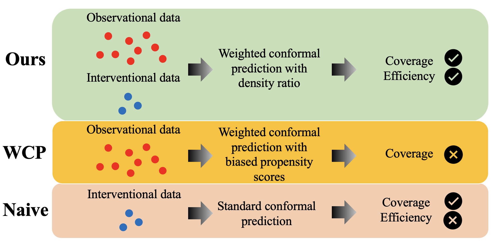

# Conformal Counterfactual Inference under Hidden Confounding (KDD’24)

Code for the KDD '24 paper, [Conformal Counterfactual Inference under Hidden Confounding](https://arxiv.org/abs/2405.12387).

**First Work on Handling Hidden Confounding for Conformal Causal Inference without strong assumptions such as Bounds on the Density Ratio**

For now, please cite the arxiv version if you find this paper/repository is helpful.
```
@misc{chen2024conformal,
      title={Conformal Counterfactual Inference under Hidden Confounding}, 
      author={Zonghao Chen and Ruocheng Guo and Jean-François Ton and Yang Liu},
      year={2024},
      eprint={2405.12387},
      archivePrefix={arXiv},
      primaryClass={cs.LG}
}
```

### Overview of the work



### Dependencies

```
pip3 install -r requirements.txt
```

### Datasets

Datasets used in this paper include
- synthetic data simulated in run_syn.py
- [Yahoo!R3 dataset](https://webscope.sandbox.yahoo.com/)
- [Coat](https://www.cs.cornell.edu/~schnabts/mnar/)

### Running the experiment

On a linux system, you can run the provided bash scripts, for the synthetic data experiment:
```
bash run_syn.sh
```

For the recommendation system rating prediction experiments:
```
bash iDCF/run_coat.sh
bash iDCF/run_yahoo.sh
```

